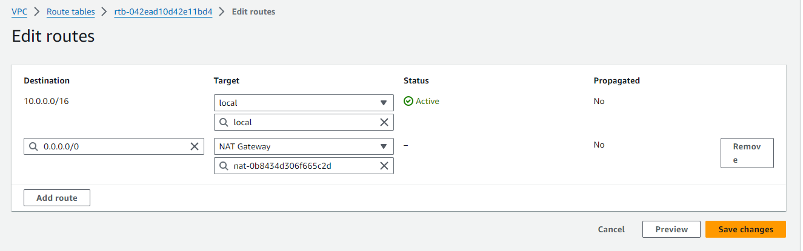
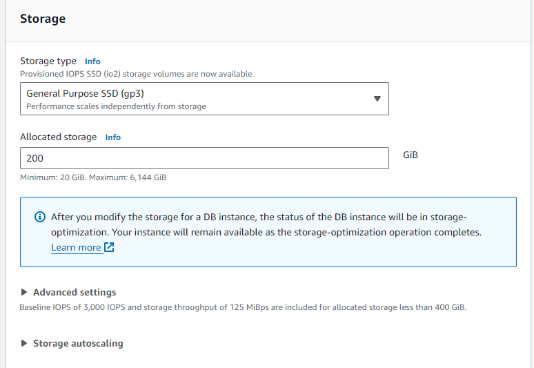
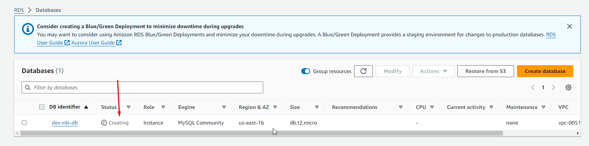
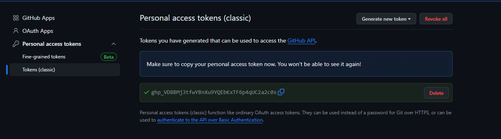

1. Docker to build the container

2. Git to track changes

3. GitHub to manage the Dockerfile and application code in Git repositories

4. AWS CLI to interact with AWS services from the commandline

5. Flyway to migrate SQL data into RDS database.

6. VS Code to write and edit scripts.

7. Amazon ECR to store the Docker images.

8. Amazon ECS to containerize the web application to AWS cloud.

9. 3 tier VPC with public and private subnets in 2 availability zones.

10. Internet Gateway to allow communication between resources in VPC and the Internet.

11. Nat Gateways to allow resources in the private subnets access to the internet.

12. Amazon MySQL RDS for relationa database.

13. ECS Fargate to run the containerized application.

14. Application Load Balancer to distribute web traffic to the ECS Fargate tasks.

15. Auto Scaling Group to dynamically create new ECS tasks.

16. Route 53 to regiter domain name and create a record set.

17. AWS S3 to store files containing environment variables for the container.

18. IAM Role to grant permission for ECS to execute tasks.

19. Using a Bastion Host to set up an SSH tunnel.

20. Security Group to control inbound and outbound traffic to resources.

21. Certificate Manager to encrypt data in transit.

## Building a Three-Tier AWS Network VPC from Scratch

The 3-tier architecture pattern is a common infrastructure pattern that divides the infrastructure into three layers: one public and two private layers. The public layer acts as a shield to the private layers. The public layer is publicly accessible, while the private layers are only accessible from within the network.
In addition to dividing the network into 3 separate layers we also want to implement some kind of high availability. AWS allows you to achieve high availability by distributing your application across multiple Availability Zones. Each Availability Zone is a physical data center in a different geographic location.

Here are the components of the above architecture.

1. **VPC** with public and private subnets in 2 availability zones.

2. An **Internet Gateway** to allow communication between instances in VPS and the Internet.

3. We are using 2 **Availability Zones** for high availability and fault tolerance.

4. Resources such as **Nat Gateway, Bastion Host and Application Load Balancer** use Public Subnets.

5. We will put the webservers and database servers in the Private Subnets to protect them.

6. The **Public Route Table** is assocated with the public subnets and routes traffic to the internet through the internet gateway.

7. The **Main Route Table** is associated with the private subnets.

### Step 1: Create a VPC

Enable DNS Hostname on the VPC

Create Internet Gateway

Attach the Internet gateway to the VPC that you created to allow the VPC to communicate with the internet.

Create Public subnets

Filter by your VPC `Dev VPC` you should see that there are no subnets in this newly created VPC

Give the subnet a name according to the reference architecture `public subnet az 1`

According to the architecture, the subnet should be in `us-east-1a` so under Availability Zone select that.

Enter the CIDR block that is given in the architecture `10.0.0.0/24`

Remember we need 2 subents, one in `us-east-1a` and another in `us-east-1b` Now create the second subnet.

Now that we have that we have to enable the auto-assign for the 2 public subnets, this means that everytime you launch an ec2 instance in your subnets, those ec2 instances will be assigned a public ip address. Do this for both subnets.

Next thing we do is create a Route Table

You will find a default Route Table, this route table is a default route table created when you create a VPC. This is the Main route tabe and is private by default.

On the drop-down select your VPC `Dev VPC`

Now that we have a Route Table, the next thing to do is to add a public route to our Route Table. The Public Route will allow the Route Table to route traffic to the Internet

Make sure that you are on the Route Tab and click on `Edit routes`

The next thing we are going to do is to associate the two subnets that we created with the public route table.

To finish we need to create our 4 Private Subnets.

### Step 2: Nat Gateways to allow resources in the private subnets access to the internet.

1. The Nat Gateway allows the instances in the private App subnets and private Data subnets to access the internet.

2. The Private Route Table is associated with the private subnets and routes traffic to the internet through the nat gateway.

Create a Private Route Table (Private Route Table AZ1)

Next add a route to the public subnet AZ1 to route traffic to the internet through the Nat Gateway in the public subnet AZ1

Next associate the route tables with our subnets

Next we create the econd Nat Gateway in the Public Subnet AZ2

Next create the last Private Route Table, following the previous steps.

## Step 3: Setting up Security Groups in AWS

1. ALB Security Group - Port 80 and 443 Source = 0.0.0.0

2. Bastion Host Security Group: Port 22 Source = Your IP Address

3. Container SG: Port 80 and 443 Source = ALB Security Group

4. Database SG: Port 3306 Source = Container SG

   Port 3306 Source = Bastion Host SG

## Step 4: Setting up my MySQL RDS Instance in AWS

On the Management console search for RDS, before creating the Database, we need to create a subnet group which will specify the subnets in which our database will be in.

Next, create the RDS Instance

## Step 5: Registering a New Domain Name in Route 53

CREATE KEY PAIRS

## Step 6: 

Create a GitHub REPO
Clone the repo locally and download zipfile for the website code

### Create a Personal Access Token for Docker to use when cloning the repository when building the Docker image

## Create a Dockerfile for a Dynamic Web App

We will add build arguments and environment variables to pass secrets to our Dockerfile

The Build Argument, allows us to build our image locally so that we can push it to Amazon ECR

Environment Variabes, 

MAKE THE SHELL SCRIPT EXECUTABLE

OPEN POWERSHELL AS AN ADMINSTRATOR, THEN PASTE THE `Set-ExecutionPolicy -ExecutionPolicy `

Now that our file executable, we will run the shell script file for our Docker image.

Run Docker images ls to see the image that we just created.

Next install Amazon Command Line, Create an IAM User with Programmatic access and run AWS Configure.

NOW THAT THE AWS CLI IS CONFIGURED, WE WILL USE THE CLI TO CREATE TO PUSH OUR IMAGE THAT WE CREATED TO AMAZON ECR

Run this command to create ecr

`aws ecr create-repository --repository-name rentzone --region us-east-1`

NOW LETS PUSH THE IMAGE THAT WE CREATED TO OUR ECR REPOSTIORY.

Now lets push the image to ECR. First opn your console to get your account ID

## SETTING UP A BASTION HOST

We will use the Bastion Host to SSH into our RDS instance in the private subnet so that we can migrate our data into the RDS database.

#### Downloading and Installing Flyway on Your Computer

Go to: https://www.red-gate.com/products/flyway/community/download/

Choose your operating system, 

CreateS3 BUCKET AND UPLOAD SCRIPT INTO IT

CREATE APPLICATION LOADBALANCER USED TO ROUTE TRAFFIC TO THE ECS FARGATE

First create a Trget Group

search bar > EC2 > Target Group > Create Target Group

Now create a Loadbalancer

an application load balancer always has to have a reach to the Public Subnets and not the Private Subnets

#### Registering for an SSL Certificate in Amazon Certificate Manager

We will use the SSL Certificate to encrypt the intransit information between our web browsers and web servers.

